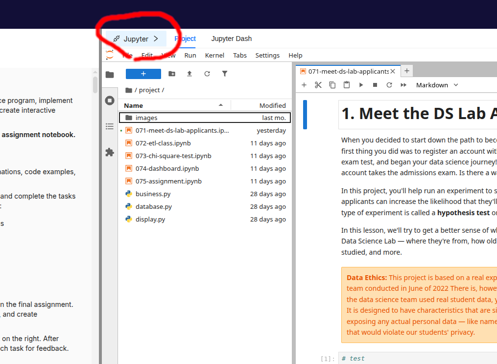

Some students have had trouble connecting to their MongoDB instance from a notebook after moving to the current platform. The most common reason is that the new platform uses a different network configuration than the previous one.

::: {.callout-important}
## Short Version

Do not connect to `localhost`. Use the MongoDB host address provided by the platform.
:::

## Find the MongoDB Host

In the platform, click the **Jupyter** button.

{fig-alt="The Jupyter button in the WQU platform interface."}

This opens a pop-up with the Jupyter and MongoDB connection details. Copy the MongoDB IP address shown there.

In your notebook, store that address in a variable:

```python
host = "your-mongodb-ip-address"
```

Then use the `host` variable when you create the MongoDB client:

```python
from pymongo import MongoClient

client = MongoClient(host=host, port=27017)
```

Using a variable makes the notebook easier to update. If the IP address changes later, you only need to update the `host` value in one place.

## Common Error: Connecting to Localhost

If you see an error like this, your code is trying to connect to `localhost`:

```text
ServerSelectionTimeoutError: localhost:27017: [Errno 111] Connection refused
```

The important part is `localhost:27017`. That means the notebook is looking for MongoDB on the notebook machine itself, not on the MongoDB host provided by the platform.

This usually happens when the code still looks like this:

```python
client = MongoClient(host="localhost", port=27017)
```

Change it to:

```python
client = MongoClient(host=host, port=27017)
```

## Why `host=host` Is Correct

The expression `host=host` can look confusing at first because the same word appears twice.

In this line:

```python
client = MongoClient(host=host, port=27017)
```

The first `host` is the parameter name expected by `MongoClient`.

The second `host` is the variable you created earlier:

```python
host = "your-mongodb-ip-address"
```

So `host=host` means: pass the value stored in the `host` variable to the `host` parameter.

## Another Common Mistake: Using `"host"` as Text

If your error message mentions something like `host:27017`, check whether your code uses quotation marks around `host`:

```python
client = MongoClient(host="host", port=27017)
```

That is different from `host=host`.

`"host"` is just the literal text `host`. Python will not replace it with your variable value.

Use this instead:

```python
client = MongoClient(host=host, port=27017)
```

## How to Read the Error Message

Error messages usually include useful clues. For MongoDB connection issues, look for the host and port in the message:

- `localhost:27017` usually means the code is still using `localhost`.
- `host:27017` usually means the code is using the string `"host"` instead of the variable `host`.
- A platform IP followed by `:27017` means the code is at least trying the intended host, so the next thing to check is whether the copied IP address is correct.

The error type is also useful. `ServerSelectionTimeoutError` means the client could not reach a MongoDB server before the timeout. In this case, the cause is often the wrong host address.

## When You Still Need Help

If you have checked the host value and still cannot connect, reach out to the support team or attend an Office Hours session. Include the exact error message and the connection code you are using, but do not share private credentials.
